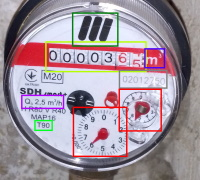

# Utility Meters - AI
## What is it?
This is the site where trained neural networks are available for working and recognizing water, gas, electricity and heat meters.

;
## How it works?
On the site you can get acquainted with trained neural networks for working with utility meters.
Some neural networks are very light and fast. They are trained to work on mobile based Mobile Net v2.
Other neural networks, which are very smart, based on YOLO, recognize on the meter not only the readings and the serial number, but also many other attributes of water, gas, electricity and heat meters.

## What does it give you?
You can get a ready-made neural network for any of your ideas for working with water and energy companies.
If you have any thoughts on how to improve the performance of neural networks, you can tell us and we will improve our networks.

## Our thanks!
We are grateful to many employees of utilities in Europe for their help in preparing the date of a network of utility meters. 
We followed [@ThreePixDroid's](https://github.com/ThreePixDroid) advice to design our website.

## License.
Our product is licensed under the [MIT](https://opensource.org/licenses/MIT) open source license.

